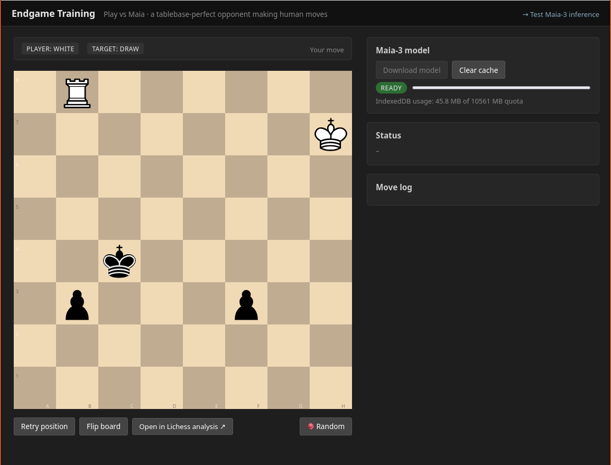

# Maia Local

A minimal replication of the [Maia Chess](https://www.maiachess.com/) play-page architecture, running entirely in the browser.

The objective of this repository is to experiment using the Maia human-like chess engine for various applications, such as training endgame positions against an opponent that plays realistic moves.

## Endgame training

By visiting `endgame_training.html` (see it live [here](https://gr-g.github.io/maia-local/endgame_training.html)), you can train yourself by playing endgame positions against a perfect - but human-like - opponent.



Going to `endgame_training.html` without any parameters will present a random endgame scenario, but in general you can play any endgame position of your choice by passing arguments for the starting position, the color you are playing, and the objective you want to achieve (checkmate or draw), like this:

[https://gr-g.github.io/maia-local/endgame_training.html?player=white&startFen=8/k1P5/8/K7/8/8/8/8 w - - 0 1&objective=checkmate](https://gr-g.github.io/maia-local/endgame_training.html?player=white&startFen=8/k1P5/8/K7/8/8/8/8%20w%20-%20-%200%201&objective=checkmate)

Training endgames against Maia has multiple advantages. First, it allows playing against a non-deterministic opponent (meaning that the opponent does not always play the same move in the same position) testing your ability to navigate different scenarios arising from the same starting position. Moreover, in both drawing and losing positions, the opponent will play moves that still resemble what a human would play to fight back. This is in contrast with what happens when playing endgames against strong engines, where the engine sometimes plays unintuitive or inexplicable moves to keep the draw (when the position is drawing), or plays just to delay mate (when losing) even if this removes any challenge - the typical example is when the engine runs away with the king knowing that it cannot stop a pawn from eventually promoting, even if this makes the exercise pointless.

As far as I am aware, this is the first endgame training application that avoids these common pitfalls.

Note that in any case Maia plays perfectly: it uses knowledge of the [endgame tablebase](https://lichess.org/api#tag/tablebase) so that:
- if a player makes a mistake (a winning position cannot be won anymore, or a drawing position becomes losing), Maia will immediately punish the mistake by choosing a move among the ones that win/draw.
- in a drawing position, Maia will choose one of the moves that keep the draw.
- in a losing position, Maia will avoid moves that reduce too much the distance to mate (or more precisely, the distance-to-zero metric).

But within these constraints, Maia will choose a move according to the probabilities estimated by the model for a (good) human player.

This application was inspired by similar projects: supertorpe's [Chess Endgame Training](https://chess-endgame-trainer.mooo.com/); and the [Endgame Trainer](https://app.endgametrainer.com/) web app.

## Model source

On first use (click **Download model**) the page fetches:

```
https://raw.githubusercontent.com/CSSLab/maia-platform-frontend/main/public/maia3/maia3_simplified.onnx
```

(~44 MB, served from GitHub). The buffer is stored in IndexedDB under the `MaiaModels` database, so subsequent loads are instant and offline-capable.

To clear the cached weights, click **Clear cache**.

## Files

| Path | Description |
| --- | --- |
| `index.html` | Play page shell |
| `endgame_training.html` | Endgame trainer shell |
| `app.js`, `endgame_training.js` | UI controllers |
| `engine.js` | Shared MaiaEngine wrapper, preprocessing/postprocessing |
| `maia-worker.js` | Web Worker: ONNX session, IndexedDB cache, inference |
| `tablebase.js` | Lichess tablebase helpers (endgame trainer) |
| `promotion.js` | Manages the overlay to select the promotion piece |
| `vendor/chessground.*.css` | Vendored chessground CSS (pieces embedded as data URIs) |
| `styles.css` | Page layout |
| `ort/` | onnxruntime-web 1.23.0 WASM runtime (single unified `.wasm` + `.mjs`) |
| `endgames.csv` | Collection of random endgame starting positions |
| `data/all_moves_maia3*.json` | Move-index for the Maia model (4352 moves) |

## Run locally

```bash
cd maia-local
python3 -m http.server 8765
# then open http://localhost:8765/
```

## Performance notes

The Maia engine runs reasonably fast on a standard desktop (typically **~100–200 ms** for inference). It might run slower on a mobile device, with up to a few seconds for inference.

It could be optimized somewhat by enabling multi-threaded inference, however this is not well supported by Github Pages (it requires something like [`coi-serviceworker`](https://github.com/gzuidhof/coi-serviceworker)) and it showed some instability when tested, so for the moment we keep it simple and single-threaded.
